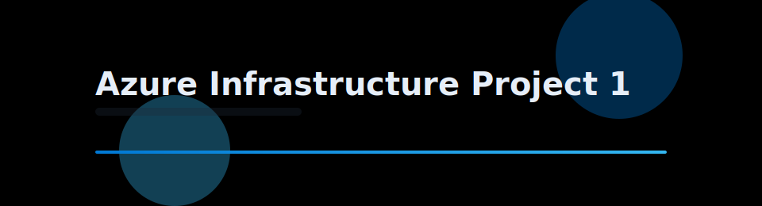

# Project TitanCloud

<p align="center">
  
</p>

---

## Overview
This project focuses on building and managing a reliable infrastructure environment using modern cloud and on-prem technologies.  
You’ll practice deployment, configuration, and optimization of key resources like compute, storage, and networking.

---

## Objectives
- Automate resource deployment with Infrastructure-as-Code (IaC).  
- Configure secure and efficient network topologies.  
- Implement high availability and cost-effective scalability.  

---

## Quick Start
```bash
git clone https://github.com/JoshG-IT/JoshG-IT.git
cd Infrastructure/Projects/Project1
